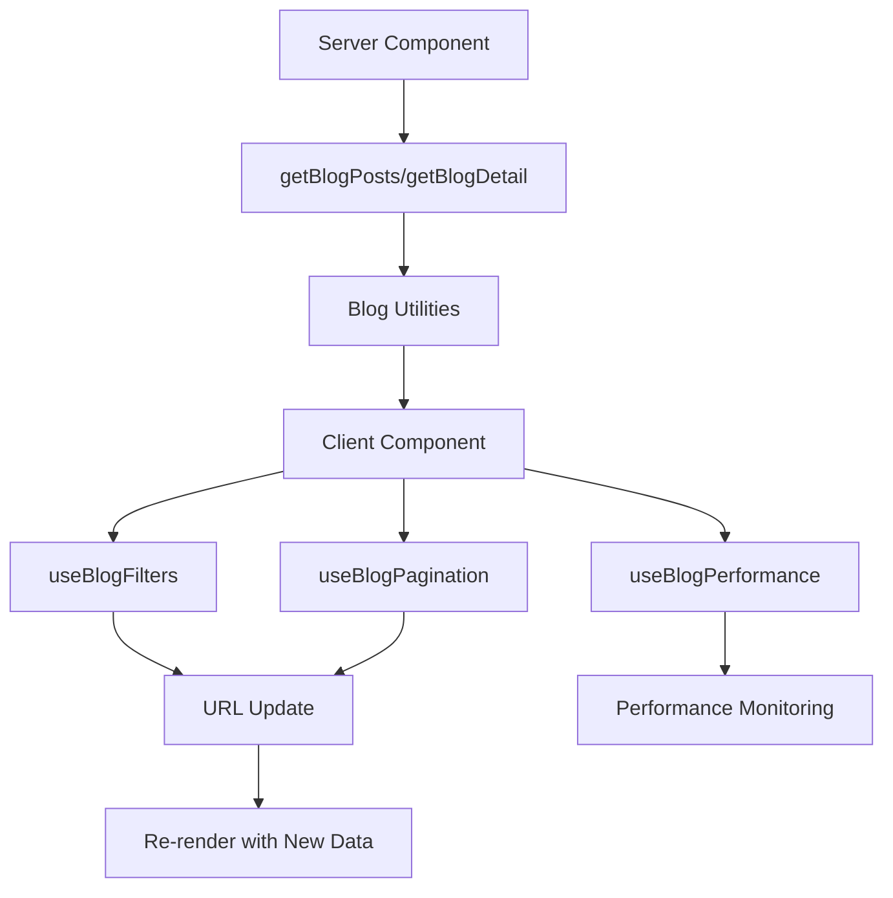

# Blog System Architecture

This document outlines the architecture and best practices for the blog system in the Menteeno frontend application.

## 🏗️ Architecture Overview

The blog system follows a modular, component-based architecture with clear separation of concerns:

```
src/components/blog/
├── blog-card.tsx                 # Reusable blog post card component
├── blog-detail-optimized.tsx    # Optimized blog detail page
├── blog-detail.tsx              # Re-export wrapper
├── blog-error-boundary.tsx      # Error boundary for blog components
├── blog-filters.tsx             # Advanced filtering component
├── blog-hero.tsx                # Blog landing page hero
├── blog-list-optimized.tsx      # Optimized blog listing
├── blog-list.tsx                # Re-export wrapper
├── blog-loading-skeleton.tsx    # Loading states
├── blog-pagination.tsx          # Pagination component
├── blog-post-content.tsx        # Blog post content display
├── blog-post-header.tsx         # Blog post header
├── blog-author-card.tsx         # Author information card
├── blog-seo-wrapper.tsx         # SEO optimization wrapper
├── blog-sidebar.tsx             # Blog sidebar
├── blog-lazy.tsx                # Lazy loading components
└── README.md                    # This file
```

## 🎯 Key Features

### 1. **Performance Optimization**
- **Lazy Loading**: Heavy components are lazy-loaded with Suspense
- **Memoization**: All components use `React.memo` for optimal re-rendering
- **Virtual Scrolling**: For large lists (via `useVirtualScroll` hook)
- **Image Optimization**: Next.js Image component with proper sizing
- **Caching**: In-memory cache with TTL for blog data

### 2. **Internationalization (i18n)**
- **Complete i18n Support**: All text is translatable
- **RTL Support**: Proper right-to-left layout for Persian
- **Locale-aware Formatting**: Dates, numbers, and text direction
- **SEO-friendly URLs**: Language-specific routes

### 3. **Error Handling**
- **Error Boundaries**: Graceful error handling for each component
- **Fallback UI**: User-friendly error messages
- **Retry Mechanisms**: Automatic retry for failed operations
- **Error Logging**: Comprehensive error tracking

### 4. **SEO Optimization**
- **Structured Data**: JSON-LD for blog posts and breadcrumbs
- **Meta Tags**: Complete Open Graph and Twitter Card support
- **Sitemap Generation**: Automatic sitemap for blog posts
- **Canonical URLs**: Proper canonical URL handling
- **Hreflang Tags**: Language alternates for international SEO

### 5. **Type Safety**
- **Comprehensive Types**: Full TypeScript coverage
- **Type Guards**: Runtime type checking
- **Interface Segregation**: Focused, single-purpose interfaces
- **Generic Hooks**: Reusable, type-safe hooks

## 🔧 Component Structure

### Core Components

#### `BlogCard`
```tsx
interface BlogCardProps {
  post: BlogPost;
  variant?: "default" | "featured" | "compact";
  showAuthor?: boolean;
  showTags?: boolean;
  showExcerpt?: boolean;
  className?: string;
}
```

#### `BlogListOptimized`
```tsx
interface BlogListProps {
  posts: BlogPost[];
  categories: BlogCategory[];
  tags: BlogTag[];
  filters: BlogFilters;
  pagination: BlogPagination;
  onFiltersChange: (filters: BlogFilters) => void;
  onPageChange: (page: number) => void;
  isLoading?: boolean;
  error?: string | null;
}
```

#### `BlogDetailOptimized`
```tsx
interface BlogDetailProps {
  post: BlogPost;
  relatedPosts: BlogPost[];
  prevPost?: BlogPost;
  nextPost?: BlogPost;
  isLoading?: boolean;
  error?: string | null;
}
```

### Utility Hooks

#### `useBlogFilters`
```tsx
const { filters, setFilters, resetFilters, hasActiveFilters } = useBlogFilters(initialFilters);
```

#### `useBlogPagination`
```tsx
const { pagination, goToPage, goToNext, goToPrev, canGoNext, canGoPrev } = useBlogPagination(pagination, onPageChange);
```

#### `useBlogPerformance`
```tsx
const { startTiming, endTiming } = useBlogPerformance();
const { loadImage, isImageLoaded } = useImageLazyLoading();
const { getCached, setCached, clearCache } = useBlogCache();
```

## 📊 Data Flow



## 🎨 Styling Guidelines

### CSS Classes
- Use Tailwind CSS utility classes
- Follow BEM methodology for custom components
- Responsive design with mobile-first approach
- Dark mode support with `dark:` prefix

### Component Variants
```tsx
// Card variants
<BlogCard variant="featured" />
<BlogCard variant="compact" />
<BlogCard variant="default" />

// Loading states
<BlogLoadingSkeleton count={6} variant="featured" />
```

## 🚀 Performance Best Practices

### 1. **Memoization**
```tsx
export const BlogCard = memo<BlogCardProps>(({ post, variant, ...props }) => {
  // Component implementation
});
```

### 2. **Lazy Loading**
```tsx
const BlogListLazy = lazy(() => import("./blog-list-optimized"));
```

### 3. **Debounced Search**
```tsx
const debouncedSearch = useDebounce(searchTerm, 300);
```

### 4. **Image Optimization**
```tsx
<Image
  src={post.seo.image}
  alt={post.title}
  width={1200}
  height={630}
  className="w-full h-auto object-cover"
  sizes="(max-width: 768px) 100vw, (max-width: 1200px) 80vw, 70vw"
  priority={isFeatured}
/>
```

## 🔍 SEO Best Practices

### 1. **Structured Data**
```tsx
const structuredData = generateBlogStructuredData(post);
<script type="application/ld+json" dangerouslySetInnerHTML={{ __html: JSON.stringify(structuredData) }} />
```

### 2. **Meta Tags**
```tsx
<Head>
  <title>{post.seo.title}</title>
  <meta name="description" content={post.seo.description} />
  <meta property="og:title" content={post.seo.title} />
  <meta property="og:description" content={post.seo.description} />
  <meta property="og:image" content={post.seo.image} />
</Head>
```

### 3. **Canonical URLs**
```tsx
<link rel="canonical" href={generateCanonicalUrl(post)} />
```

## 🧪 Testing Strategy

### Unit Tests
- Component rendering tests
- Hook behavior tests
- Utility function tests

### Integration Tests
- User interaction flows
- API integration tests
- Error boundary tests

### E2E Tests
- Complete user journeys
- Cross-browser compatibility
- Performance testing

## 📈 Monitoring & Analytics

### Performance Metrics
- Component render times
- Image load times
- API response times
- Cache hit rates

### Error Tracking
- Error boundary captures
- API error logging
- User interaction errors

### SEO Monitoring
- Core Web Vitals
- Search console integration
- Structured data validation

## 🔧 Configuration

### Environment Variables
```env
NEXT_PUBLIC_BASE_URL=https://menteeno.com
NEXT_PUBLIC_GA_ID=G-XXXXXXXXXX
NEXT_PUBLIC_SENTRY_DSN=https://...
```

### Cache Configuration
```tsx
const CACHE_DURATION = 5 * 60 * 1000; // 5 minutes
const MAX_CACHE_SIZE = 100; // items
```

## 🚀 Deployment Considerations

### Build Optimization
- Tree shaking for unused code
- Code splitting by route
- Image optimization
- CSS purging

### CDN Configuration
- Static asset caching
- API response caching
- Image optimization
- Gzip compression

### Monitoring Setup
- Error tracking (Sentry)
- Performance monitoring (Web Vitals)
- Analytics (Google Analytics)
- Uptime monitoring

## 📚 Additional Resources

- [Next.js Documentation](https://nextjs.org/docs)
- [React Performance](https://react.dev/learn/render-and-commit)
- [SEO Best Practices](https://developers.google.com/search/docs)
- [TypeScript Handbook](https://www.typescriptlang.org/docs/)
- [Tailwind CSS](https://tailwindcss.com/docs)

---

**Last Updated**: January 2025  
**Version**: 2.0.0  
**Maintainer**: Menteeno Development Team
